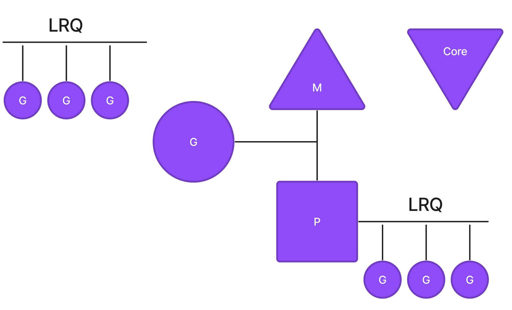
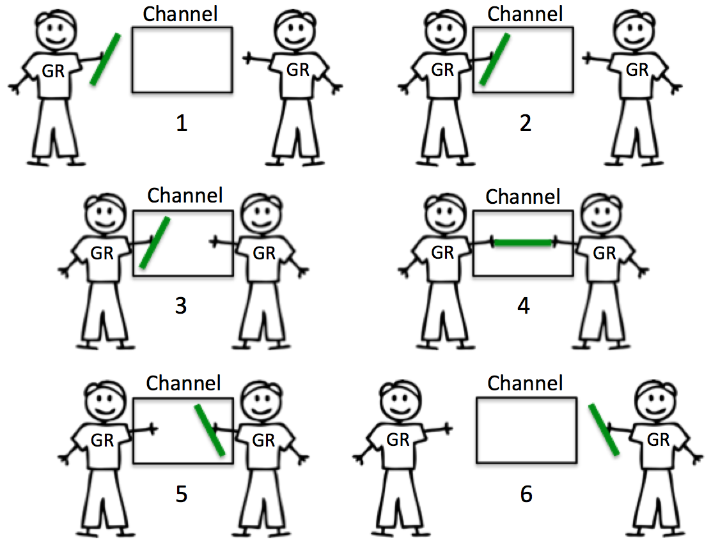
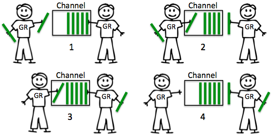

## Планировщик в go


Планировщик Go отвечает за управление горутинами. Он решает, на каком ядре, когда и какая из них должна быть запущена.

Планировщик Go работает на уровне **M:G:P**, где **M** — количество операционных потоков (OS threads), **G** — горутины, а **P** — количество логических процессоров. Суть этой модели в том, что горутины (G) планируются для выполнения на операционных потоках (M), которые в свою очередь запускаются на логических процессорах (N). Грубо говоря, мы берём какой-то поток, на него подставляем P (некий процессор), и планировщик определяет, какая горутина работает на этом процессоре в определённый момент времени.

Существует две важные структуры в данных для управления горутинами
> **LPQ** - это очередь выполнения для конкретного процессора (P). У каждого P есть своя собственная очередь с горутинами, готовыми к выполнению на этом процессоре.

> **GRQ** - это общая очередь выполнения с горутинами, готовыми к выполнению, но не назначенными конкретному процессору (P). Когда P ищет горутину для выполнения и его LRQ пуст, он может взять её из GRQ.

Характеристика горутин:
- Горутина — это структура, которая выполняет переданную функцию
- Самый объёмный элемент структуры — stack. По умолчанию выделяется `2 Кб`
- В процессе выполнения стек может увеличиваться, если потребуется
- У стека есть максимальный размер: `1 Гб` для `64 бит`, `250 Мб` для `32 бит`

## Каналы
Каналы в Go — ключевой элемент в эффективном и безопасном параллельном коде. В отличие от других примитивов синхронизации (например, условных переменных и мьютексов, о которых вы узнаете позднее), каналы предоставляют более высокоуровневый и естественный для Go способ обмена данными между горутинами.

``` go
package main

import (
	"fmt"
)

func main() {
	ch := make(chan int)
	go func() {
		ch <- 123 // отправляем значение в канал
	}()
	val := <-ch // получаем значение из канала
	fmt.Println(val) // выводит 123
}
```

## Буферизованные и небуферизованные каналы
У **небуферизованных** каналов нет внутреннего буфера, поэтому необходимо, чтобы обе горутины были готовы к обмену. Если горутина пытается отправить данные в небуферизованный канал, а горутины, которая ожидала бы получить эти данные, нет, канал заблокирует отправляющую горутину и заставит её ждать. И наоборот, когда горутина пытается получить данные из небуферизованного канала, а горутины, которая собирается отправить ресурс, нет, канал заблокирует принимающую горутину и заставит ждать её.



У **буферизованных** каналов есть внутренний буфер, поэтому они могут вести себя немного по-другому. Когда горутина пытается отправить данные в буферизованный канал, но он заполнен, канал блокирует горутину и заставляет ждать, пока буфер не станет доступным. Если в канале есть место, отправка может произойти немедленно, и горутина может двигаться дальше. Когда горутина пытается получить данные из буферизованного канала, а буферизованный канал пуст, канал блокирует горутину и заставляет ждать, пока данные туда не будут отправлены.



## Дедлок
Дедлок — состояние, при котором группа горутин вечно ожидают друг друга, так как никто не может продолжить выполнять свой код. Обычно это происходит, когда горутина ожидает получить данные из канала, но никакая другая горутина их туда не отправляет. В таких случаях Go завершает выполнение программы и выводит сообщение о дедлоке.

```go
package main

func main() {
	ch := make(chan int)
	ch <- 1 // это приведёт к дедлоку, так как нет другой горутины, которая могла бы принять значение
}
```
В этом примере горутина, которая запущена функцией main, пытается отправить значение в канал, но нет другой горутины, которая могла бы его принять. Горутина блокируется, других горутин, которые могли бы разблокировать её, нет.