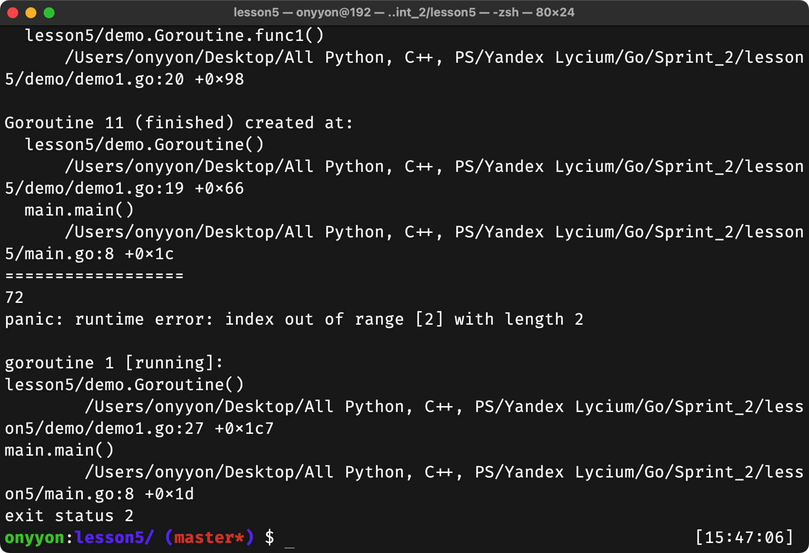

# Базовые паттерны concurrency пакета sync
## Navigation
- [Sync](#sync)
- [Mutext/RWMutex](#mutexrwmutex)
- [Каналы](#каналы)
- [WaitGroup](#waitgroup)
- [Once](#once)
- [Cond](#cond)
## Sync
На этом уроке мы познакомимся с важным пакетом стандартной библиотеки языка Go — ```sync``` и узнаем, чем он полезен при разработке конкурентных программ.

Все примеры программ из этого урока нужно запускать с ```go run -race main.go```. Флаг ```-race`` активирует инструмент анализа гонок во время компиляции и выполнения программы. Если конкурентный код будет написан с проблемами, вы узнаете об этом из терминала программы.
## Mutex/RWMutex
Если мы хотим гарантировать, что только у одной горутины есть доступ к ресурсу в один момент времени, нам пригодится мьютекс.

Представим: наша функция возвращает случайное число. Мы хотим получить 10 таких случайных чисел. Напишем функцию:
```go
func random() int {
	const max int = 100
	return rand.Intn(max)
}
```
Заведём слайс из 10 элементов, вызовем функцию в цикле и получим такую простую программу:
```go
package main

import (
	"fmt"
	"math/rand"
)

// функция генерирует случайное число в интервале [0, 100)
func random() int {
	const max int = 100
	return rand.Intn(max)
}

func main() {
	const size int = 10
	results := []int{}
	// заполняем слайс случайными числами
	for i := 0; i < size; i++ {
		results = append(results, random())
	}

	// поэлементно выводим слайс на экран
	for i := 0; i < size; i++ {
		fmt.Println(results[i])
	}
}
```
А теперь представим себе, что ```random()``` — это очень сложная для вычислений функция. Естественно, мы хотим сделать вычисления конкурентными, а не делать их последовательно.
Давайте вызовем каждую функцию ```random()``` в отдельной горутине:
```go
go func() {
	results = append(results, random())
}()
```
После заполнения слайса поставьте задержку ```time.Sleep(time.Second)``` в секунду, чтобы все горутины успели завершиться (это некрасивое решение, но пока не будем обращать на него внимание). Запустите готовую программу:
```go
package main

import (
	"fmt"
	"math/rand"
	"time"
)

// функция генерирует случайное число в интервале [0, 100)
func random() int {
	const max int = 100
	return rand.Intn(max)
}

func main() {
	const size int = 10
	results := []int{}
	// заполняем слайс случайными числами
	for i := 0; i < size; i++ {
		go func() {
			results = append(results, random())
		}()
	}
	time.Sleep(time.Second)

	// поэлементно выводим слайс на экран
	for i := 0; i < size; i++ {
		fmt.Println(results[i])
	}
}
```
Не забудьте о флаге -race (```go run -race main.go```).

Программа выдаст на экран сообщение ```WARNING: DATA RACE``` и сообщение вида ```panic: runtime error`: index out of range [3] with length 3.```


Тут мы должны вспомнить, что делает функция ```append``` и как работает слайс. Этот код меняет массив, ссылка на который хранится в слайсе ```results```, потому что вместимости слайса недостаточно. Необходимо выделить новый массив и скопировать туда данные из старого. Таким образом программа пытается поменять этот массив из нескольких горутин.

Решить такую проблему можно с помощью мьютекса: ```mx := &sync.Mutex{}```

Окружаем нужный нам блок кода методами ```Lock``` и ```Unlock``` и тем самым гарантируем, что доступ к слайсу получает только одна горутина в один момент времени:

```go
go func() {
	// вызван Lock, поэтому только одна горутина за раз может получить доступ к слайсу
	mx.Lock()
	defer mx.Unlock()
	results = append(results, random())
}()
```
Сейчас программа выглядит так:
```go
package main

import (
	"fmt"
	"math/rand"
	"sync"
	"time"
)

// функция генерирует случайное число в интервале [0, 100)
func random() int {
	const max int = 100
	return rand.Intn(max)
}

func main() {
	const size int = 10
	mx := &sync.Mutex{}
	results := []int{}
	// заполняем слайс случайными числами
	for i := 0; i < size; i++ {
		go func() {
			// вызван Lock, поэтому только одна горутина за раз может получить доступ к слайсу
			mx.Lock()
			defer mx.Unlock()
			results = append(results, random())
		}()
	}
	time.Sleep(time.Second)

	// вызван Lock, потому что здесь тоже обращаемся к results
	mx.Lock()
	defer mx.Unlock()
	// поэлементно выводим слайс на экран
	for i := 0; i < size; i++ {
		fmt.Println(results[i])
	}
}
```
Эта программа конкурентна, но её сложно читать и модифицировать. Давайте воспользуемся структурами, чтобы создать безопасный слайс и использовать его в функции ```main()```.

Структура будет выглядеть так:
```go
type SafeSlice struct {
	results []int
	mx      *sync.Mutex
}
```
Обратите внимание: мы не хотим давать пользователю доступ к внутренним полям нашей структуры.

Проассоциируйте со структурой две функции:
```go
// добавляем к слайсу элемент item
func (s *SafeSlice) Append(item int) {
    // вызван Lock, поэтому только одна горутина за раз может получить доступ к слайсу
	s.mx.Lock()
	defer s.mx.Unlock()
	s.results = append(s.results, random())
}

// получаем элемент слайса по индексу
func (s *SafeSlice) Get(index int) int {
    // вызван Lock, поэтому только одна горутина за раз может получить доступ к слайсу
	s.mx.Lock()
	defer s.mx.Unlock()
	return s.results[index]
}
```
Мы получили структуру, которая инкапсулирует в себя слайс и даёт пользователю две возможности:
- добавить элемент
- получить элемент по индексу

Всё как в обычном слайсе, только вызвать можно в разных горутинах.

Добавьте функцию, которая создаёт экземпляр нашей структуры, для удобства пользователя:
```go
func New() *SafeSlice {
	return &SafeSlice{
		mx:      &sync.Mutex{},
		results: []int{},
	}
}
```
Готовую программу удобно читать и модифицировать. Пользователь получил возможность безопасно создавать ```slice```, с которым можно работать из разных горутин и не думать о безопасности доступа к ним:
```go
package main

import (
	"fmt"
	"math/rand"
	"sync"
	"time"
)

type SafeSlice struct {
	results []int
	mx      *sync.Mutex
}

func New() *SafeSlice {
	return &SafeSlice{
		mx:      &sync.Mutex{},
		results: []int{},
	}
}

// добавляем к слайсу элемент item
func (s *SafeSlice) Append(item int) {
	// вызван Lock, поэтому только одна горутина за раз может получить доступ к слайсу
	s.mx.Lock()
	defer s.mx.Unlock()
	s.results = append(s.results, random())
}

// получаем элемент слайса по индексу
func (s *SafeSlice) Get(index int) int {
	// вызван Lock, поэтому только одна горутина за раз может получить доступ к слайсу
	s.mx.Lock()
	defer s.mx.Unlock()
	return s.results[index]
}

// функция генерирует случайное число в интервале [0, 100)
func random() int {
	const max int = 100
	return rand.Intn(max)
}

func main() {
	safeSlice := New()
	const size int = 10
	// заполняем слайс случайными числами
	for i := 0; i < size; i++ {
		go func() {
			safeSlice.Append(random())
		}()
	}
	time.Sleep(time.Second)

	// поэлементно выводим слайс на экран
	for i := 0; i < size; i++ {
		fmt.Println(safeSlice.Get(i))
	}
}
```
Если есть переменная (обычно это слайс или карта), с которой хочется работать из разных горутин, бывает удобно инкапуслировать её в структуру в виде поля и добавить мьютекс, как в приведённом примере.

А теперь давайте придумаем, как избавиться от ```time.Sleep(time.Second)```
## Каналы
Давайте применим подход с ожиданием блокировки на канале, чтобы избавиться от ```time.Sleep(time.Second)```.

Вот простой пример:
```go
package main

import (
	"fmt"
	"time"
)

func main() {
	ch := make(chan struct{})
	// горутина, которая асинхронно производит вычисления
	go func() {
		fmt.Println("начинаем вычисления...")
		// имитируем длинные вычисления
		time.Sleep(time.Second)
		fmt.Println("заканчиваем вычисления ...")
		// закрываем канал, чтобы получить сообщения
		close(ch)
	}()

	// программа блокируется
	<-ch
	fmt.Println("завершаем программу")
}
```
В этом примере основная горутина будет заблокирована на строке <-ch. Пока из канала не будет прочитано сообщение, строка fmt.Println("завершаем программу") не выполнится. При чтении из закрытого канала мы получаем дефолтное значение типа данных. В нашем случае дефолтным будет пустая структура.

Можно представить алгоритм работы так:

- инициализируем канал
- что-то асинхронно делаем
- там, где нужно подождать, читаем из канала
- после завершения действия закрываем канал

Но в нашем исходном примере надо было дождаться завершения не одной горутины, а сразу нескольких. Как же быть?

Давайте решим задачу в лоб. Заведём каналы по числу задач, завершения которых хотим дождаться:

- создаём слайс из каналов (не забудьте о функции make)
```go
const size int = 10
channels := make([]chan struct{}, size)
for i := range channels {
	channels[i] = make(chan struct{})
}
```
- ожидаем сообщения из всех каналов
```go
for i := 0; i < size; i++ {
	<-channels[i]
}
```
В результате получим такой код:
```go
package main

import (
	"fmt"
	"math/rand"
	"sync"
)

type SafeSlice struct {
	results []int
	mx      *sync.Mutex
}

func New() *SafeSlice {
	return &SafeSlice{
		mx:      &sync.Mutex{},
		results: []int{},
	}
}

// добавляем к слайсу элемент item
func (s *SafeSlice) Append(item int) {
	// вызван Lock, поэтому только одна горутина за раз может получить доступ к слайсу
	s.mx.Lock()
	defer s.mx.Unlock()
	s.results = append(s.results, random())
}

// получаем элемент слайса по индексу
func (s *SafeSlice) Get(index int) int {
	// вызван Lock, поэтому только одна горутина за раз может получить доступ к слайсу
	s.mx.Lock()
	defer s.mx.Unlock()
	return s.results[index]
}

// функция генерирует случайное число в интервале [0, 100)
func random() int {
	const max int = 100
	return rand.Intn(max)
}

func main() {
	safeSlice := New()
	const size int = 10
	// объявляем слайс каналов
	channels := make([]chan struct{}, size)
	// создаём каналы функцией make
	for i := range channels {
		channels[i] = make(chan struct{})
	}
	// заполняем слайс случайными числами
	for i := 0; i < size; i++ {
		go func(i int) {
			safeSlice.Append(random())
			// закрываем канал после выполнения задачи
			close(channels[i])
		}(i)
	}
	// ждём, пока не получим сообщения из всех каналов
	for i := 0; i < size; i++ {
		<-channels[i]
	}

	// поэлементно выводим слайс на экран
	for i := 0; i < size; i++ {
		fmt.Println(safeSlice.Get(i))
	}
}
```
Согласитесь, код довольно громоздкий. При этом для конкурентного программирования довольно естественно было бы запустить несколько конкурентных вычислений и выполнить какое-то действие над полученным результатом, когда они завершатся. Давайте попробуем упростить программу.
## WaitGroup
Настала пора раскрыть карты. Всё, что мы пытались запрограммировать вручную, уже есть в стандартной библиотеке, в объекте WaitGroup. Это счётчик горутин, выполнения которых нужно дождаться.

Чтобы воспользоваться этим типом, создадим его экземпляр:
```go
// создаём экземпляр WaitGroup
wg := &sync.WaitGroup{}
```
WaitGroup предоставляет три проассоциированные функции:

- `Wait` — программа блокируется, пока значение счётчика положительное
- `Add` — увеличивает количество счётчика на n (если передать отрицательное число, счётчик уменьшается)
- `Done` — уменьшает счётчик на 1 (тождественно вызову Add(-1), так эта функция и имплементирована в стандартной библиотеке)
Перед вызовом каждой нашей горутины будем увеличивать счётчик на 1 (чтобы дождаться выполнения ещё одной горутины):
```go
for i := 0; i < size; i++ {
	// Добавляем в группу 1 элемент
	wg.Add(1)
	go func() {
		...
}
```
Обратите внимание: мы знаем, что хотим дождаться выполнения `size` горутин. Поэтому можем заменить это вызовом ```wg.Add(size)```:
```go
wg.Add(size)
for i := 0; i < size; i++ {
	// Добавляем в группу 1 элемент
	go func() {
		...
}
```
Добавим ожидание выполнения всех горутин группы:
```go
wg.Add(size)
for i := 0; i < size; i++ {
	go func() {
		...
}
// ждём выполнения всех горутин группы (пока счётчик не станет равным 0)
wg.Wait()
```
После выполнения горутины нужно не забыть декрементировать счётчик:
```go
go func() {
	// удаляем один элемент из группы
	defer wg.Done()
	safeSlice.Append(random())
}()
```
Обратите внимание, что к моменту, когда мы вызываем `wg.Wait()`, счётчик должен быть инкрементирован.

Частая ошибка:
```go
for i := 0; i < size; i++ {
	go func() {
		// мы не можем быть уверены, что эта функция вызовется до wg.Wait()
		wg.Add(size)
		...
}
wg.Wait()
```
В итоге получим такой код:
```go
package main

import (
	"fmt"
	"math/rand"
	"sync"
)

type SafeSlice struct {
	results []int
	mx      *sync.Mutex
}

func New() *SafeSlice {
	return &SafeSlice{
		mx:      &sync.Mutex{},
		results: []int{},
	}
}

// добавляем к слайсу элемент item
func (s *SafeSlice) Append(item int) {
	// вызван Lock, поэтому только одна горутина за раз может получить доступ к слайсу
	s.mx.Lock()
	defer s.mx.Unlock()
	s.results = append(s.results, random())
}

// получаем элемент слайса по индексу
func (s *SafeSlice) Get(index int) int {
	// вызван Lock, поэтому только одна горутина за раз может получить доступ к слайсу
	s.mx.Lock()
	defer s.mx.Unlock()
	return s.results[index]
}

// функция генерирует случайное число в интервале [0, 100)
func random() int {
	const max int = 100
	return rand.Intn(max)
}

func main() {
	safeSlice := New()
	const size int = 10
	// создаём экземпляр WaitGroup
	wg := &sync.WaitGroup{}

	// заполняем слайс случайными числами
	for i := 0; i < size; i++ {
		// добавляем в группу один элемент
		wg.Add(1)
		go func() {
			// удаляем один элемент из группы
			defer wg.Done()
			safeSlice.Append(random())
		}()
	}
	// ждём выполнения всех горутин группы
	wg.Wait()

	// поэлементно выводим слайс на экран
	for i := 0; i < size; i++ {
		fmt.Println(safeSlice.Get(i))
	}
}
```
Это простой поддерживаемый код, который реализован с помощью стандартного инструмента.
При работе с `WaitGroup` используется такой алгоритм:
- cоздать экземпляр `var wg WaitGroup`
- добавить количество горутин, которые будут выполняться `wg.Add(<количество горутин>)`
- запустить горутины, сопровождая их `wg.Done()`
- дождаться завершения `wg.Wait()`

И ещё раз обратите внимание на эти особенности работы со счётчиком:
- `WaitGroup` нельзя копировать после первого использования
- Add добавляет `delta`, которая может быть отрицательной, к счётчику `WaitGroup`
- Если счётчик обнуляется, все горутины, заблокированные `Wait`, освобождаются.
- Если счётчик становится отрицательным, `Add` вызывает `panic`
- `Done` уменьшает счётчик `WaitGroup` на один
- Все вызовы `Add`, которые происходят, когда счётчик равен 0, должны происходить до `Wait`

## Once
Если вам нужно инициализировать какой-то ресурс или глобальную переменную, вы можете воспользоваться объектом Once. Этот механизм синхронизации позволяет выполнить функцию единожды.

Давайте напишем функцию, которая имитирует инициализацию ресурсов:
```go
initializeResources := func() {
	time.Sleep(time.Second)
	fmt.Println("Only once initialize something")
}
```
и вызовем её `10` раз. Подобные программы мы с вами уже писали:
```go
package main

import (
	"fmt"
	"sync"
	"time"
)

func main() {
	wg := &sync.WaitGroup{}
	// функция, которая имитирует инициализацию ресурсов
	initializeResources := func() {
		time.Sleep(time.Second)
		fmt.Println("Only once initialize something")
	}
	for i := 0; i < 10; i++ {
		wg.Add(1)
		go func() {
			defer wg.Done()
			initializeResources()
		}()
	}
	wg.Wait()
}
```
Эта программа напечатает на экране `Only once initialize something 10 раз`.

Go даёт возможность выполнить функцию `initializeResources` всего один раз. Для этого мы создаём экземпляр объекта `sync.Once` — `var once sync.Once` и вызываем функцию `initialize` так: `once.Do(initializeResources)`.

Готовая программа напечатает на экране `Only once initialize something` один раз:
```go
package main

import (
	"fmt"
	"sync"
	"time"
)

func main() {
	// создаём экземпляр Once
	var once sync.Once
	wg := &sync.WaitGroup{}
	// функция, которая имитирует инициализацию ресурсов
	initializeResources := func() {
		time.Sleep(time.Second)
		fmt.Println("Only once initialize something")
	}
	for i := 0; i < 10; i++ {
		wg.Add(1)
		go func() {
			defer wg.Done()
			// в каждой горутине вызываем функцию Do
			once.Do(initializeResources)
		}()
	}
	wg.Wait()
}
```
Выполнение программы заблокируется при выполнении `Do`.

Внимательный студент мог заметить, что это похоже на паттерн `Singleton`. Использовать его нужно осознанно, так как он представляет глобальное состояние. Возможно, инициализация ресурсов может быть выполнена синхронно в начале работы программы.

## Cond
Давайте рассмотрим такую задачу:

есть три горутины: ``G1``, ``G2``, ``G3``
горутина `G1` получает данные из некоторого источника
горутины `G2` и `G3` должны дождаться того, как горутина `G1` получит эти данные, и что-то с ними сделать
То есть `G2` и `G3` должны быть заблокированы до того момента, пока `G1` не даст им какой-то сигнал.

Стандартная библиотека предоставляет нам объект `sync.Cond`. Конструктор его принимает в качестве аргумента `Locker` — мы будем использовать объект `Mutex`:
```go
cond := sync.NewCond(&sync.Mutex{})
```
У него есть три важные проассоциированные функции:
- `Signal()` — отправляет сигнал одной горутине
- `Broadcast()` — отправляет сигнал всем горутинам
- `Wait()` — ожидает сигнал

Напишем функцию слушателя, которая ждёт сигнала о том, что можно начинать обработку данных:
```go
func listen(name string, data map[string]string, c *sync.Cond) {
	c.L.Lock()
	c.Wait()

	fmt.Printf("[%s] %s\n", name, data["key"])

	c.L.Unlock()
}
```
Напишем горутину, которая получает данные и посылает слушателям сигнал о начале их обработки:
```go
func broadcast(name string, data map[string]string, c *sync.Cond) {
	time.Sleep(time.Second)

	c.L.Lock()

	data["key"] = "value"

	fmt.Printf("[%s] данные получены\n", name)

	// отправляем сигнал слушателям
	c.Broadcast()
	c.L.Unlock()
}
```
Вызов `cond.Wait` обязательно нужно вызывать до вызова `cond.Broadcast`, иначе слушатели повиснут навсегда.

Скомпонуем готовые функции:
```go
package main

import (
	"fmt"
	"os"
	"os/signal"
	"sync"
	"time"
)

func listen(name string, data map[string]string, c *sync.Cond) {
	c.L.Lock()
	c.Wait()

	fmt.Printf("[%s] %s\n", name, data["key"])

	c.L.Unlock()
}

func broadcast(name string, data map[string]string, c *sync.Cond) {
	time.Sleep(time.Second)

	c.L.Lock()

	data["key"] = "value"

	fmt.Printf("[%s] данные получены\n", name)

	c.Broadcast()
	c.L.Unlock()
}

func main() {
	data := map[string]string{}

	cond := sync.NewCond(&sync.Mutex{})

	go listen("слушатель 1", data, cond)
	go listen("слушатель 2", data, cond)

	go broadcast("источник", data, cond)

	ch := make(chan os.Signal, 1)
	signal.Notify(ch, os.Interrupt)
	<-ch
}
```
Алгоритм использования `Cond` такой:
- создать и инициализировать экземпляр `sync.Cond` с помощью `sync.NewCond(&sync.Mutex{})`
- ожидать выполнения условия
```go
cond.L.Lock()
for !condition {
  cond.Wait()
}
// выполнение задачи
cond.L.Unlock()
```
- сигнализировать о выполнении условия `cond.Signal()`